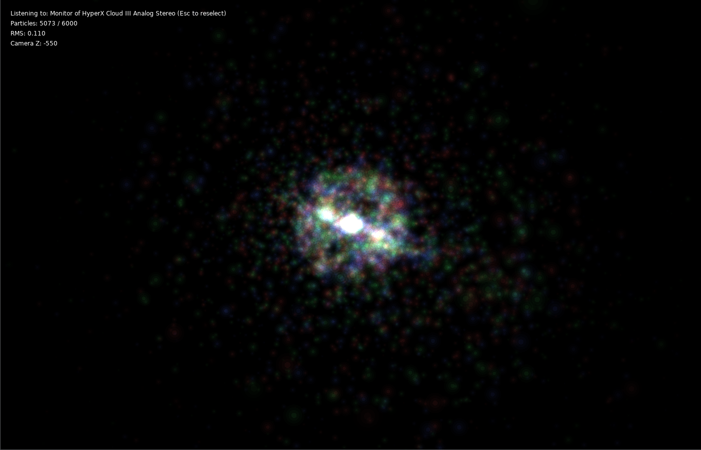
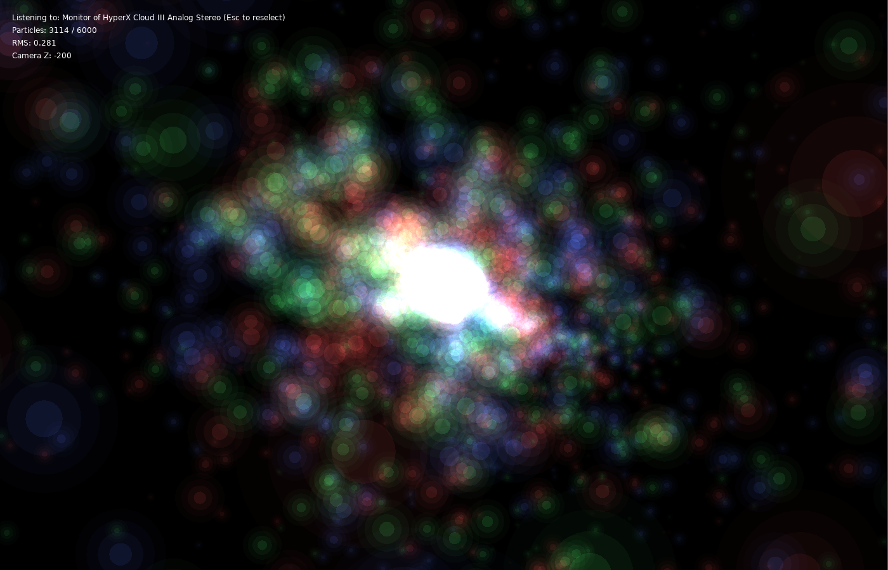
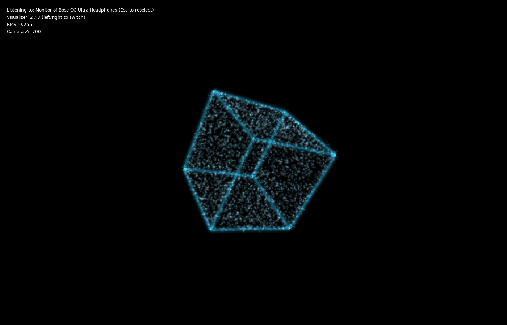

# Don's Particle Visualizer

This project is an **audio-reactive particle visualizer** built with [LÖVE](https://love2d.org/).
For best results, run it on a desktop with a microphone or audio loopback device.

---

## Requirements

* [LÖVE framework](https://love2d.org/) (version 11.x or later recommended)
* A microphone or a "monitor" (speaker loopback) input device

---

## How to Run

1. Clone this repository.

2. In the project root, start the visualizer with:

   ```bash
   love .
   ```

3. When the program starts, you’ll see a list of available input devices:

   * Click on a device name, or press its number key to select it.
   * Devices containing `"monitor"` are speaker loopback inputs (good for visualizing music playback).

4. To reselect an input device, press **Escape** at any time.

---

## Controls

* **Mouse click**: Select an input device (before one is active).
* **Left click & drag**: Rotate the 3D camera.
* **Scroll wheel**: Zoom the camera in/out.
* **Escape**: Stop and return to device selection.
* **Left / Right arrow keys**: Switch between available visualizers.

---

## Features

* Multiple visualizer modules, with seamless switching.
* Dynamic particle emission and bloom intensity based on RMS audio volume.
* Smooth 3D camera rotation and zoom.
* Support for both microphone and speaker-monitor devices.
* Optimized particle systems (thousands of particles in real-time).
* On-screen HUD showing:
  * Selected device
  * Current visualizer index / total visualizers
  * Current RMS volume
  * Camera Z-position

---

Here’s your updated `README.md` section with **`screenshot3.png`** added, showcasing a *different mode* of the visualizer:

---

## 📸 Screenshots / Demo

Here are some examples of the visualizer in action:

<p align="center">
  <br/>
  <em>Particle bloom reacting to music input</em>
</p>

<p align="center">
  <br/>
  <em>Rotated view of 3D particle field</em>
</p>

<p align="center">
  <br/>
  <em>Alternate cube-based visualizer mode with directional particle bursts</em>
</p>

<p align="center">
  <br/>
  <em>Live audio-reactive animation (GIF demo)</em>
</p>